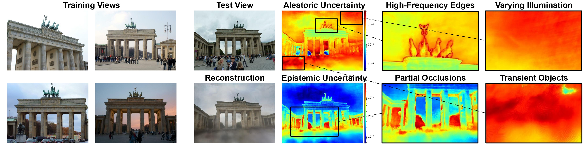

<div align="center">
<h1>Evidential Neural Radiance Fields</h1>

<p>
  <a href="https://arxiv.org/abs/2602.23574" target="_blank"></a>
  <a href="https://cvpr.thecvf.com/media/PosterPDFs/CVPR%202026/39517.png?t=1779222257.6720781" target="_blank"></a>
  <a href="https://www.youtube.com/watch?v=TDtQUcnTXC4" target="_blank"></a>
</p>

[Ruxiao Duan](https://scholar.google.com/citations?user=QHxJoWEAAAAJ), [Alex Wong](https://scholar.google.com/citations?user=K9_XuM8AAAAJ)

[Yale Vision Laboratory, Yale University](https://vision.cs.yale.edu/)

</div>

## Overview

Evidential Neural Radiance Field (Evidential NeRF) is an uncertainty quantification framework based on deep evidential regression that directly estimates both aleatoric uncertainty (arising from inconsistent knowledge) and epistemic uncertainty (arising from insufficient knowledge) of NeRF renderings.



## Installation

The framework is built upon [nerfstudio](https://docs.nerf.studio/) v1.1.4 ([installation instructions](https://docs.nerf.studio/quickstart/installation.html)).
```
pip install --upgrade pip setuptools
pip install torch==2.1.2+cu118 torchvision==0.16.2+cu118 --extra-index-url https://download.pytorch.org/whl/cu118
pip install ninja git+https://github.com/NVlabs/tiny-cuda-nn/#subdirectory=bindings/torch
```

Install nerfstudio by
```
pip install git+https://github.com/nerfstudio-project/nerfstudio.git@v1.1.4
```
or
```
git clone https://github.com/nerfstudio-project/nerfstudio.git --branch v1.1.4
cd nerfstudio
pip install -e .
cd ..
```

Install the uncertainty quantification package by

```
pip install -e .
ns-install-cli
```

## Data

Run these scripts to download and process data in `data` folder.
```
bash nerfstudio_uncertainty/scripts/data_processing/lf.sh
bash nerfstudio_uncertainty/scripts/data_processing/llff.sh
bash nerfstudio_uncertainty/scripts/data_processing/robustnerf.sh
bash nerfstudio_uncertainty/scripts/data_processing/phototourism.sh
```

## Training

Scripts are in `nerfstudio_uncertainty/scripts`. Run them by
```
bash nerfstudio_uncertainty/scripts/lf/evidential.sh
```

## Citation

```bibtex
@inproceedings{duan2026evidential,
  title={Evidential Neural Radiance Fields},
  author={Duan, Ruxiao and Wong, Alex},
  booktitle={Proceedings of the IEEE/CVF Conference on Computer Vision and Pattern Recognition},
  year={2026}
}
```
